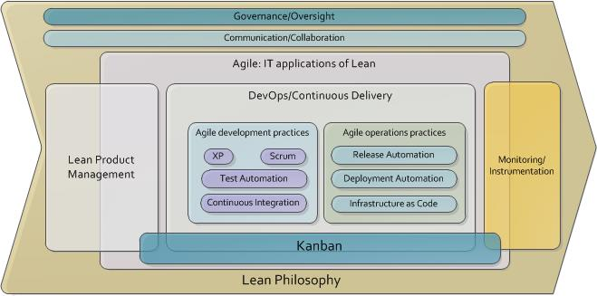

= IT4IT Agile Scenario

// Push titles down one level.
:leveloffset: 1

include::01-Purpose.adoc[]

// Return to normal title levels.
:leveloffset: 0

== Version of the Reference Architecture

This document is based on version [1.3] of the Reference Architecture.

== Document Change History

|=============================================================
|Version|	Date    |Author(s)        |Status   |Remarks
|0.1		|         |Charles T. Betz  |Draft	  |Initial draft
|0.2	  |8/4/2014 |Charles T. Betz  |Draft	  |Updated draft
|0.3	  |8/19/2014|Charles T. Betz  |Draft 	  |Updated draft
|0.5    |9/27/2014|Charles T. Betz &
                    Sue Desiderio	  |Draft	  |Combined
                                               product/portfolio
                                               backlog & DevOps
                                               work
|0.6    |10/5/2014|Charles T. Betz |	Draft	|Final edits
|=============================================================

The document should follow the process explained in more detail in the IT4IT Forum document

== Contributors
* Charles Betz
* Sue Desiderio
*	Phillippe Geneste
* Lars Rossen
* Vasu Sasikanth Sankhavaram
* Karel van Zeeland

== Copyright
Any material used, shared or developed from the contents of this document must include either the following graphical stamp or incorporate a similar statement attributing the content to the IT4IT Consortium.
[to be inserted]

== Business Context
The Agile movement now represents many years of experience and theory and increasingly defines both the goals of information technology management as well as its execution.

Business strategies increasingly emphasize business experimentation, “Fail Fast,” and “Think Big, Start Small” [1].  These strategies require corresponding IT agility: moving from large “batches” of project requirements to the software equivalent of Lean “single-piece flow.”

There are many books and other resources available describing Agile and the reader is referred to the references, especially [2-4] as initial reading.

Figure 1. Lean, Agile, Devops, and related conceptual framing

“Lean” is the overall philosophical framework, generally credited to Ohno and others at Toyota [5], with the name “Lean” first applied by Krafcik [6] and further Western development and popularization by Womack, Jones, Liker, and others [7-9]. Another key related source is the writings of Eli Goldratt [10, 11].
The application of Lean philosophy to software engineering is closely related to the term “Agile,” as in “Agile Development.” The often-cited “Agile Manifesto” [12] states:

_We are uncovering better ways of developing software by doing it and helping others do it. Through this work we have come to value:_

* _Individuals and interactions over processes and tools_
* _Working software over comprehensive documentation_
* _Customer collaboration over contract negotiation_
* _Responding to change over following a plan_

_That is, while there is value in the items on the right, we value the items on the left more._

The Poppendiecks were early appliers of Lean principles to software development [13]. David Anderson has popularized the Toyota Production System term “Kanban” as a form of collaborative work management for software product teams, focused on self-organizing teams strongly concerned with flow and limiting work in process  [2]. Both the Poppendiecks and Anderson cite the influence of Don Reinertsen [4, 14]. The Phoenix Project is a notable exploration of the Lean, Agile, and DevOps themes [15].

--insert figure 2--

As seen in Figure 2, the traditional IT value chain has a number of challenges. Manual processes, silo walls between development and operations, and poorly integrated tools are some of the problems seen in the legacy methods to IT product development.

“DevOps” (Figure 3) is the emerging industry response. Coined as a portmanteau representing “Development” and “Operations” (Patrick Debois is generally credited with originating the term), it represents the specific concerns of accelerating flow and software delivery from ideation through production, extending Agile philosophy from its traditional home in software development into operational domains. Fast feedback is a critical objective

[bibliography]
.References
- [[[2]]] Anderson, D.J. 'Kanban: Successful Evolutionary Change for your Technology Business'. 2010, Sequim, WA: Blue Hole Press.
- [[[3]]] Humble, J. and Farley, D., 'Continuous delivery'. 2011, Boston: Addison-Wesley. xxxiii, 463 p.
- [[[4]]] Reinertsen, D.G., 'The principles of product development flow: se...''
